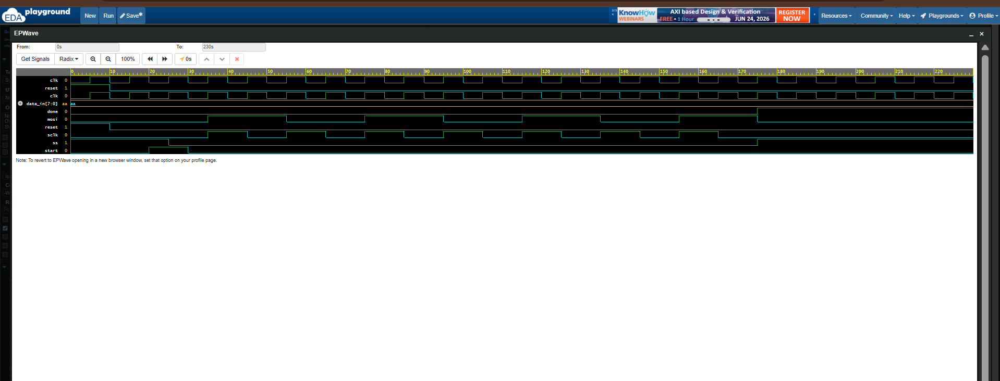
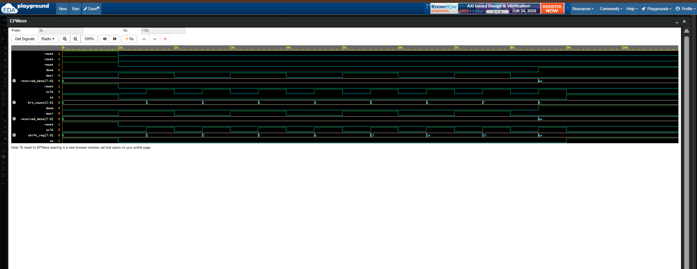
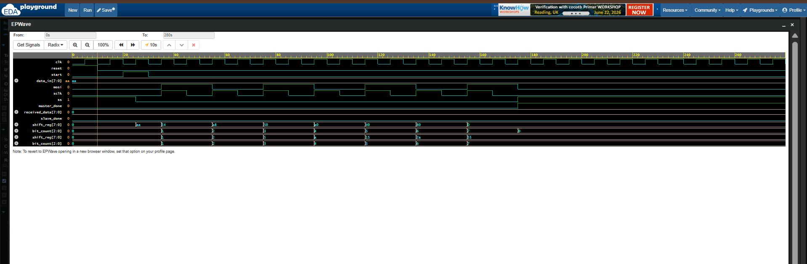

# 📡🚀 SPI Protocol Using Verilog HDL 🏆💻

A complete implementation of the SPI (Serial Peripheral Interface) protocol using Verilog HDL. This project demonstrates the design, verification, and integration of SPI Master and SPI Slave modules to achieve successful serial communication.

---

## 🌟 Project Overview

SPI is one of the most widely used serial communication protocols in embedded systems, FPGAs, and ASICs.

This repository presents a step-by-step implementation of:

✅ SPI Master

✅ SPI Slave

✅ Complete SPI Master-Slave Communication System

verified through RTL simulation using EDA Playground and EPWave.

---

## 🏗️ SPI Architecture

SPI communication uses four signals:

- 📤 MOSI (Master Out Slave In)
- 📥 MISO (Master In Slave Out)
- ⏰ SCLK (Serial Clock)
- 🎯 SS (Slave Select)

```
Master                     Slave
┌────────┐              ┌────────┐
│        │ MOSI ──────► │        │
│        │ MISO ◄────── │        │
│        │ SCLK ──────► │        │
│        │ SS   ──────► │        │
└────────┘              └────────┘
```

---

## 📂 Repository Structure

```text
SPI-Protocol-Using-Verilog-HDL/
│
├── SPI_Master/
├── SPI_Slave/
├── SPI_System/
└── README.md
```

---

# 🚀 Phase 1: SPI Master

### Features

✅ Generates SPI Clock (SCLK)

✅ Controls Slave Select (SS)

✅ Transmits 8-bit serial data through MOSI

✅ Indicates completion using done signal

---

### Example Transmission

Data Sent:

```text
10101010
```

---

### 📸 Waveform



---

# 🚀 Phase 2: SPI Slave

### Features

✅ Detects active-low SS

✅ Receives serial data through MOSI

✅ Shifts incoming bits into register

✅ Stores received byte

✅ Indicates completion using done signal

---

### Example Reception

Data Received:

```text
10101010
```

---

### 📸 Waveform



---

# 🚀 Phase 3: Complete SPI Master-Slave System

### Features

✅ Integrates SPI Master and SPI Slave

✅ Performs real-time serial communication

✅ Transfers complete 8-bit frame

✅ Verifies end-to-end functionality

---

### Communication Verified

Master Transmitted:

```text
10101010
```

Slave Received:

```text
10101010
```

---

### 📸 Waveform



---

## 🛠️ Tools Used

- Verilog HDL
- EDA Playground
- EPWave

---

## 🎯 Learning Outcomes

Through this project, I gained practical understanding of:

- SPI Protocol Fundamentals
- Serial Communication
- Shift Registers
- Clock-Based Data Transfer
- Master-Slave Architecture
- RTL Design
- Module Integration
- RTL Verification Techniques

---

## 👩‍💻 Author

**Aneesa Pattan**

Final Year Electronics and Communication Engineering (ECE) Student

Passionate about VLSI Design, Digital Design, Embedded Systems, and Hardware Development.

---

⭐ If you found this project interesting, feel free to star the repository!
